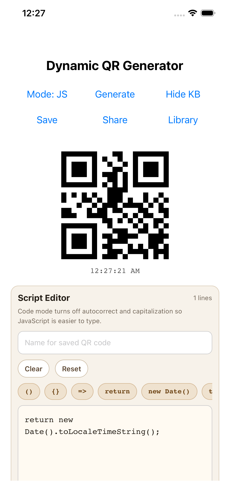
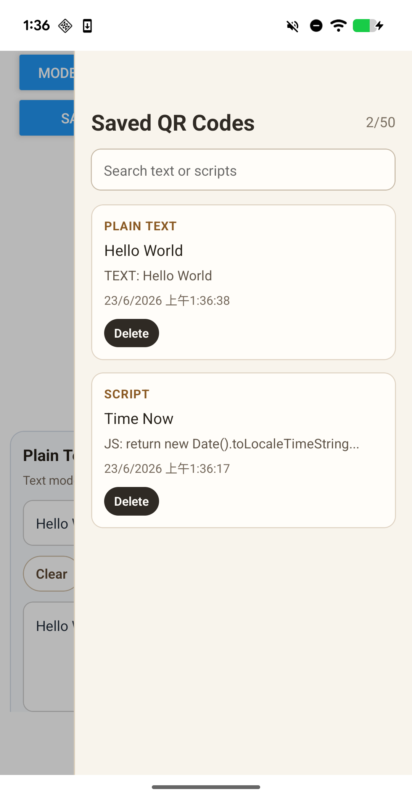

# Dynamic QR Code Generator


This app allow user to generate and store QR code by simple Javascript Function. It is built by React Native Expo.

## Generate QR Code By JavaScript And Store QR Code
<table>
	<tr>
		<td></td>
		<td></td>
	</tr>
</table>

# How to Start Development
```sh
npm run start
```

# How to Unit Test
```sh
npm run test
```

# How to Check Unit Test Coverage
```sh
npm run test:coverage
```

This prints the local coverage summary in the terminal and writes the report files to the `coverage/` folder.

# Build App By Expo Android
```sh
npx eas-cli build --platform android --profile production
```

# Build App By Expo IOS
```sh
npx eas-cli build --platform ios --profile production
```
